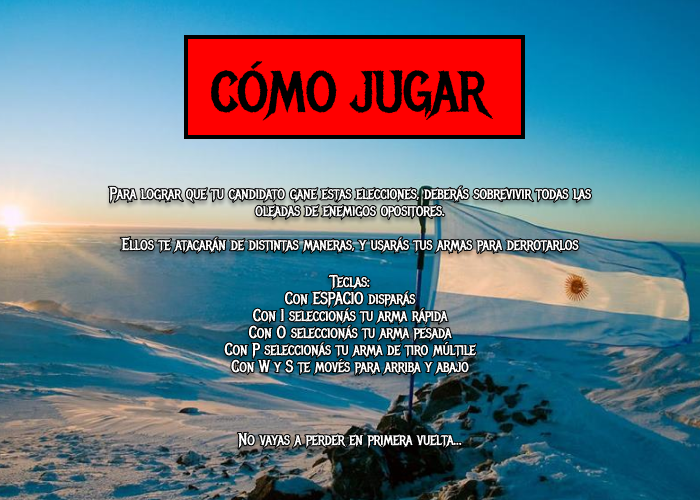

# Ballotage 23

## Equipo de desarrollo

-   Liam Ezekiel Wilk
-   Marcos Nicolau
-   Francisco Declich
-   Celeste Dellisola

## Instrucciones

## Capturas

## Otros

-   Curso/Facultad: Martes mañana en UTN FRBA
-   Versión de wollok: Wollok TS (modificado)
-   Una vez terminado, no tenemos problemas en que el repositorio sea público
